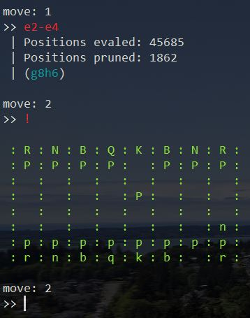

# minichess v.0.5

MiniChess is a simplistic Chess AI using the minimax algorithm. You play as white, and MiniChess is black. Make your move by entering the two squares, separated by a dash (e.g `e2-e4`).

Huge thanks to [bhlangonijr](https://github.com/bhlangonijr) for providing the library I used for move generation and piece representation.

## Future features to implement:
- Alpha-beta pruning
- Support for allowing MiniChess to play as white.
- Adding more error-handling.
