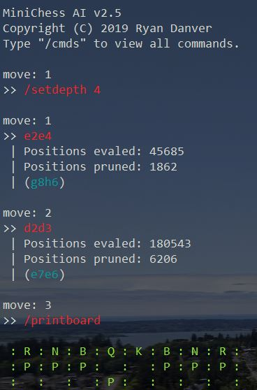

# MiniChess v.2.5

MiniChess is a simplistic Chess AI program that uses the minimax algorithm with alpha-beta pruning. You play as white, and MiniChess is black. Make your move by entering the two squares (e.g `>>f2f4`) Once entered, MiniChess will return it's decided move, in addition to the amount of positions evaluated, and pruned.

## Minimax
Minichess uses the minimax algorithm (hence the name). Minimax is a recursive algorithm that find the best possible move it can with the given depth. For the game of chess, white is the maximizer, and black is the minimizer. The maximizer tries to maximize the score, and the minimizer tries to minimize the score. Inside minimax, the maximizer first loops through all possible moves, and recursively calls minimax. When the maximizer calls minimax, it's switched to the minimizer, which does the same thing trying to minimize the score. Each time minimax calls itself for every move, the depth is decremented by 1. The minimax function returns the static evaluation of the board when the depth is equal to 0. The new values propagate up, and fill in the function calls within the stack.

### Pruning
Alpha–beta pruning is an optimization algorithm that decreases the number of nodes on the minimax tree. It's important to note that pruning doesn't actually improve evaluation, it only makes it faster.

While it might seem logical to add up the evaluated and pruned positions to get the total number of possible positions, this isn't true. Instead, pruned positions refers to the amount of positions where parts of the tree were cut off, meaning the actual amount of possible positions can be much greater.

### Depth
As stated in the paragraph above, the depth is value that determines how deep the minimax tree will be. If the depth is higher, the number of positions evaluated will rise exponentially. 

When you first start MiniChess, an initial depth must be entered using the `/setdepth` command.

## Commands
MiniChess has several built in commands. Here's a list of them all, and their different functions:

`/save [name]` - Saves the current board state to a file.

`/load [name]` - Loads board state from file.

`/setdepth [depth]` - Sets the search depth for the minimax tree.

`/printboard` - Prints a representation of the current board.

`/exit` - Exits the program.

`/resetgame` - Resets the board, move counter, and depth.

`/cmds` - Prints all commands.

`/version` - Prints version and credits.
