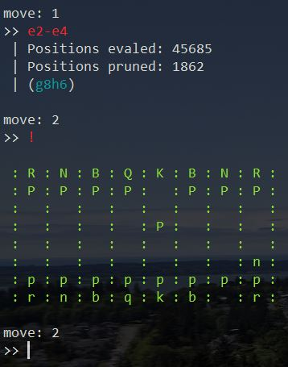

# minichess v.1.0

MiniChess is a simplistic Chess AI using the minimax algorithm with alpha-beta pruning. You play as white, and MiniChess is black. Make your move by entering the two squares, separated by a dash (e.g `e2-e4`). You can also print a simple representation of the board by typing in `!`.

Huge thanks to [bhlangonijr](https://github.com/bhlangonijr) for providing the library I used for move generation and piece representation.

## Future features to implement:
- Support for allowing MiniChess to play as white.
- Adding more error-handling.
